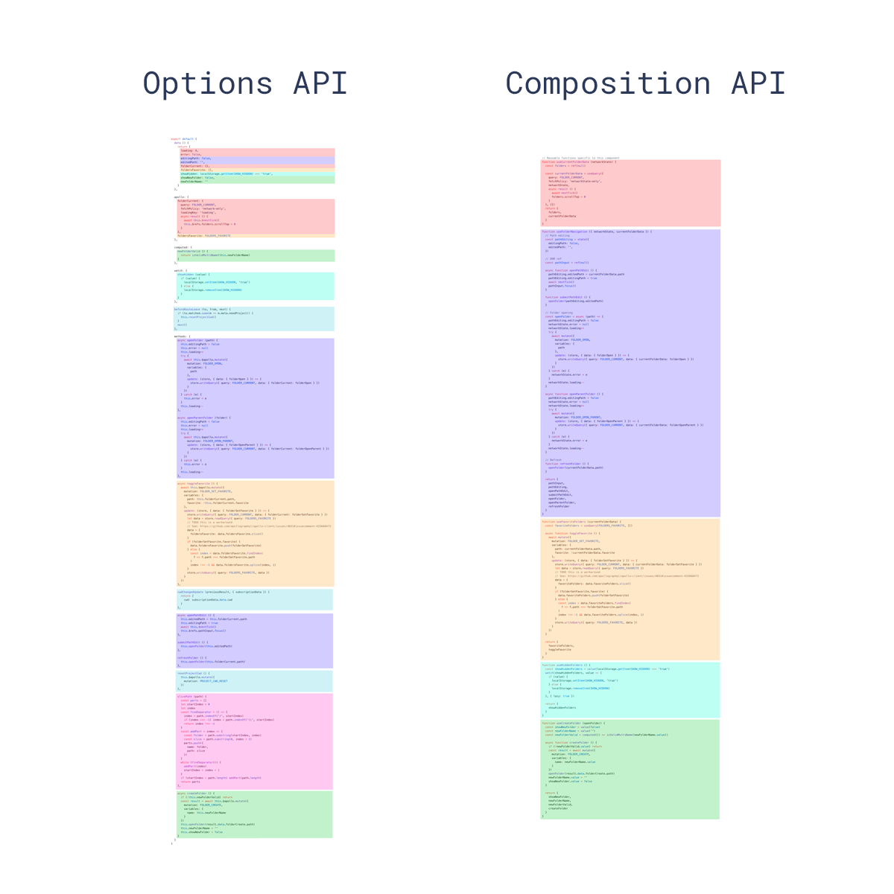

官方

[composition-api手册](https://composition-api.vuejs.org/zh/api.html)
[Vue3文档](https://v3.cn.vuejs.org/guide)
[Vue3文档-en](https://v3.vuejs.org/guide/installation.html)
[vue3-beta源码](https://github.com/vuejs/vue-next)
[Vue RFCs](https://github.com/vuejs/rfcs)

[vue3模板编译在线体验](https://vue-next-template-explorer.netlify.app/)

文章
[抄笔记：尤雨溪在Vue3.0 Beta直播里聊到了这些…](https://juejin.im/post/5e9f6b3251882573a855cd52)
[尤雨溪在Vue3.0 Beta直播同步更新 | Vue3新特性一篇搞懂](https://juejin.im/post/5e6388366fb9a07cda097c47)
[Vue3 究竟好在哪里？（和 React Hook 的详细对比）](https://juejin.im/post/5e9ce011f265da47b8450c11)
[尤大Vue3.0直播虚拟Dom总结(和React对比)](https://juejin.im/post/5e9faa8fe51d4546fe263eda)

[深入理解 Vue3 Reactivity API](https://zhuanlan.zhihu.com/p/146097763)

[Vue3生态技术内幕](https://www.yuque.com/woniuppp/vue3/intro)

[vue 3.x 如何有惊无险地快速入门](https://juejin.im/post/5ec537486fb9a047bb6a4204)

# Vue3新特性

## 六大亮点
* Performance：性能更比Vue 2.0强。
* Tree shaking support：可以将无用模块“剪辑”，仅打包需要的。
* Composition API：组合API
* Fragment, Teleport, Suspense新组件：“碎片”，Teleport即Protal传送门，“悬念”
* Better TypeScript support：更优秀的Ts支持
* Custom Renderer API：暴露了自定义渲染API

### Performance
* 重写了虚拟Dom的实现（且保证了兼容性，脱离模版的渲染需求旺盛）。
* 编译模板的优化。
* 更高效的组件初始化。
* update性能提高1.3~2倍。
* SSR速度提高了2~3倍。

### Tree shaking support
* 可以将无用模块“剪辑”，仅打包需要的模块
* 一个简单“HelloWorld”大小仅为：13.5kb
  * 使用Composition API，仅11.75kb，
* 包含运行时完整功能：22.5kb
  * 拥有更多的功能，却比Vue 2更迷你。

```js
// vue 2.x
import Vue from 'vue'

// vue 3.x
import {xxx,xxx} from 'vue'
```

### Composition API
* 可与现有的 Options API一起使用
* 灵活的逻辑组合与复用
* vue 3的响应式模块可以和其他框架搭配使用

混入(mixin) 将不再作为推荐使用， Composition API可以实现更灵活且无副作用的复用代码。

### Fragment、\<Teleport>、\<Suspense>
`Fragment 碎片`
* 不再限于模板中的单个根节点
* render 函数也可以返回数组了，类似实现了 React.Fragments 的功能 

`\<Teleport> 传送门`

* 旨在在当前组件之外呈现某些内容。这也是这是处理模态框、弹出窗口和通常显示在页面顶部的组件的一种非常好的方法。
* 原称为\<Portal>，因为Chrome有个提案，会增加一个名为Portal的原生element，为避免命名冲突，改为Teleport


`\<Suspense> 悬念`
* 可在嵌套层级中等待嵌套的异步依赖项
* 支持async setup()
* 支持异步组件


### 更好的TypeScript支持
* Vue 3是用TypeScript编写的库，可以享受到自动的类型定义提示
* JavaScript和TypeScript中的API是相同的。
* 支持TSX

### Custom Renderer API：自定义渲染器API
可以在其他平台扩展
[感兴趣可以看这里](https://vugel.planning.nl/#application)

### vite
 [vite-github](https://github.com/vitejs/vite)

一个简易的http服务器，无需webpack编译打包，根据请求的Vue文件，直接发回渲染，且支持热更新（非常快）

# Vue3使用

## 基本
Vue2.x 使用 Options API   
Vue3 使用 Composition API（组合API）



体验
vue-cli
>vue create vue3 (vue-cli4版本)
>vue add vue-next 

vite
>npm init vite-app \<project-name>


基本使用
```js
import { createApp, createComponent } from 'vue'
// 根组件
const App = createComponent({
  components: { Counter },
  template: `
    <div class="container">
        <h3>计数器示例</h3>
        <Counter />
    </div>
  `
})
```
## [应用配置/ 应用API / 全局API](https://v3.cn.vuejs.org/api/application-config.html)
|2.x Global API| 3.x Instance API(app)
|:--|:--
|Vue.config | app.config
|Vue.config.productionTip| 已移除
|Vue.config.ignoredElements|app.config.isCustomElement
|Vue.component|app.component
|Vue.directive|app.directive
|Vue.mixin|app.mixin
|Vue.use|app.use

* [createApp](https://v3.cn.vuejs.org/api/global-api.html#createapp) 创建一个新的vue实例

```js
import { createApp } from 'vue'
const app = createApp()

// app.use
// app.component
// app.directive
// app.mixin
// app.config
....
```

在应用之间共享配置 (如组件或指令)

Foo 和 Bar 实例及其后代中都可以使用 focus 指令
```js
import { createApp } from 'vue'
import Foo from './Foo.vue'
import Bar from './Bar.vue'

const createMyApp = options => {
  const app = createApp(options)
  app.directive('focus' /* ... */)
  return app
}

createMyApp(Foo).mount('#foo')
createMyApp(Bar).mount('#bar')
```

* [globalProperties](https://v3.cn.vuejs.org/api/application-config.html#globalproperties)--挂载全局方法属性
```js
// Vue 2.x
Vue.prototype.$http = xxx

// Vue 3.x
const app = Vue.createApp({})
app.config.globalProperties.$http = xxx

```
注意，不可再setup里直接通过this调用，无法访问到 this，会返回undefined；
```js
setup() {
  const {ctx} = getCurrentInstance()
  console.log(ctx.$api);
}
```

也可在vue2.x的生命周期里调用如created,mounted等

* [nextTick](https://v3.cn.vuejs.org/api/global-api.html#nexttick) 将回调推迟到下一个 DOM 更新周期之后执行,即Vue2.x的 this.$nextTick方法
```js
import { createApp, nextTick } from 'vue'

const app = createApp({
  setup() {
    const message = ref('Hello!')
    const changeMessage = async newMessage => {
      message.value = newMessage
      await nextTick()
      console.log('Now DOM is updated')
    }
  }
})
```

* [h](https://v3.cn.vuejs.org/api/global-api.html#h) 返回一个”虚拟节点“，用于手动编写的渲染函数


* [defineComponent](https://v3.cn.vuejs.org/api/global-api.html#definecomponent) 从实现上看，defineComponent 只返回传递给它的对象。但是，就类型而言，返回的值有一个合成类型的构造函数，用于手动渲染函数
```js
import { defineComponent } from 'vue'

// 具有组件选项的对象
const MyComponent = defineComponent({
  data() {
    return { count: 1 }
  },
  methods: {
    increment() {
      this.count++
    }
  }
})

// 或者是一个 setup 函数，函数名称将作为组件名称来使用
const HelloWorld = defineComponent(function HelloWorld() {
  const count = ref(0)
  return { count }
})
```

* [defineAsyncComponent](https://v3.cn.vuejs.org/api/global-api.html#defineasynccomponent) 创建一个异步组件
  
基本语法  
```js
defineAsyncComponent(() => import('xxx.vue')),
```

高阶用法
```js
const AsyncComp = defineAsyncComponent({
  // 工厂函数
  loader: () => import('./Foo.vue')
  // 加载异步组件时要使用的组件
  loadingComponent: LoadingComponent,
  // 加载失败时要使用的组件
  errorComponent: ErrorComponent,
  // 在显示 loadingComponent 之前的延迟 | 默认值：200（单位 ms）
  delay: 200,
  // 如果提供了 timeout ，并且加载组件的时间超过了设定值，将显示错误组件
  // 默认值：Infinity（即永不超时，单位 ms）
  timeout: 3000,
  // 定义组件是否可挂起 | 默认值：true
  suspensible: false,
  /**
   *
   * @param {*} error 错误信息对象
   * @param {*} retry 一个函数，用于指示当 promise 加载器 reject 时，加载器是否应该重试
   * @param {*} fail  一个函数，指示加载程序结束退出
   * @param {*} attempts 允许的最大重试次数
   */
  onError(error, retry, fail, attempts) {
    if (error.message.match(/fetch/) && attempts <= 3) {
      // 请求发生错误时重试，最多可尝试 3 次
      retry()
    } else {
      // 注意，retry/fail 就像 promise 的 resolve/reject 一样：
      // 必须调用其中一个才能继续错误处理。
      fail()
    }
  }
})
```

* [resolveComponent](https://v3.cn.vuejs.org/api/global-api.html#resolvecomponent) 解析组件, `只能在 render 或 setup 函数中使用`

如果在当前应用实例中可用(全局组件过或当前页面局部注册的组件)，则允许按名称解析 component。

返回一个 Component。如果没有找到，则返回 undefined。
```js
import { resolveComponent } from 'vue'
render() {
  const MyComponent = resolveComponent('MyComponent')
}
```

* resolveDirective  解析指令`只能在 render 或 setup 函数中使用`

* ...

## Vue3常用API
```js
import {
  createApp,
  ref, // 创建一个响应式的数据对象
  reactive, // 创建响应式数据对象
  toRefs, // 将响应式数据对象转换为单一响应式对象
  isRef, // 判断某值是否是引用类型
  computed, // 创建计算属性
  watch, // 创建watch监听
  getCurrentInstance, // 当前组件的实例
  onBeforeMount,
  onMounted,
  onBeforeUpdate,
  onUpdated,
  onBeforeUnmount,
  onUnmounted,
} from 'vue'
```

## [生命周期](/src/components/lifeCycle/index.vue)


### 2.x生命周期选项和Composition API之间的映射
* beforeCreate -> 使用 setup()
* created -> 使用 setup()
* beforeMount -> onBeforeMount
* mounted -> onMounted
* beforeUpdate -> onBeforeUpdate
* updated -> onUpdated
* beforeDestroy -> onBeforeUnmount
* destroyed -> onUnmounted
* errorCaptured -> onErrorCaptured
* onRenderTracked, 新增 
* onRenderTriggered, 新增

两个新增的钩子都接收DebuggerEvent类似于onTrack和onTrigger观察者的选项;它使我们能够知道是什么导致了Vue实例中的重新渲染。
```js
onRenderTriggered(()=>{
  // 检查哪个依赖项导致组件重新呈现

  debugger
})

// 需要package.json设置
"rules": {
  "no-debugger": "off"
}
```


### 生命周期调用顺序 
```js
// 创建
setup ->
beforeCreate ->
created ->
onBeforeMount ->
onRenderTracked ->
onMounted ->
onRenderTriggered  ->
onBeforeUpdate  ->
onUpdated  ->

// 更新
onRenderTriggered ->
onBeforeUpdate ->
onUpdated ->

// 销毁
onBeforeUnmount  ->
onUnmounted  ->
```

## [setup()](/src/components/setup/index.vue)
* setup 是 vue3 中统一的入口函数,所有生命周期函数定义都是需要定义在次函数下才生效
* setup函数会在 beforeCreate之后 created之前执行
* setup 函数中无法访问到 this
* setup创建组件实例时，在初始道具解析后立即调用。在生命周期方面，它在beforeCreate挂接之前被调用。
* setup接受两个参数，
  * props(默认是响应式)
  * context(包含attrs, slots, emit) 上下文对象，
* return 返回一个对象,用于返回数据和方法

```js
setup(props,context){
// setup(props,{attrs, slots, emit}){// context解构写法
  console.log(props,context)// {attrs, slots, emit}
  return {}
} 
```

## [ref、reactive、isRef 、toRefs ](/src/components/reactive/index.vue)
* ref : 创建一个响应式的数据对象 ,通过 .value 获取值,主要是对String,Number,Boolean等基本类型的数据响应

* reactive: 创建响应式数据对象 ,可以观察多个属性//相当于2.x的Vue.observable()

* readonly: 设置为只读属性

* toRefs: 将 reactive 创建的对象所有的属性都转换成可观察的 Ref 对象，这样一来，即使解构后，也可以被独立进行观察了。

* toRef： 将 reactive 创建的对象的某个属性转换成可观察的 Ref 对象

* unref: 如果参数是一个 ref 则返回它的 value，否则返回参数本身。它是 val = isRef(val) ? val.value : val 的语法糖。

* isRef: 检查值是否是 ref 生成的响应式数据对象
* isReactive: 检查值是否是 reactive 生成的响应式数据对象
* isReadonly: 检查值是否是 只读
* isProxy: 检查对象是否是由reactive或readonly创建的


`为什么将可观察对象中的属性解构出来后，变成不再可观察了呢？`

因为通过 reactive 函数创建的可观察对象，内部的属性本身并不是可观察类型的，对他们访问和观察其实都是通过Proxy代理访问来实现的。如果将这些属性解构，这些属性就不再通过原对象的代理来访问了，就无法再进行观察,可以使用 toRefs。
```js
let state = reactive({num:1})
return {
  // ...state 解构后的属性，变成非响应式
  ...toRefs(state) // 使用toRefs包装成响应式
}
```

### [`高级响应式系统API`](https://composition-api.vuejs.org/zh/api.html#%E9%AB%98%E7%BA%A7%E5%93%8D%E5%BA%94%E5%BC%8F%E7%B3%BB%E7%BB%9F-api)
* customRef: 用于自定义一个 ref
* markRaw: 显式标记一个对象为“永远不会转为响应式代理”，函数返回这个对象本身
* shallowReactive: 只为某个对象的私有（第一层）属性创建`浅层`的响应式代理
* shallowReadonly: 只为某个对象的自有（第一层）属性创建`浅层`的只读响应式代理
* shallowRef: 创建一个 ref ，将会追踪它的 .value 更改操作，但是并不会对变更后的 .value 做响应式代理转换（即变更不会调用 reactive）
* toRaw: 返回由 reactive 或 readonly 方法转换成响应式代理的普通对象

## [computed](/src/components/computed/index.vue)

## [watch，watchEffect](/src/components/watch/index.vue)
* watch : 创建 watch 监听
* watchEffect : 如果响应性的属性改变，就会触发这个函数


### 与 watchEffect 比较，watch 允许我们：
* 懒执行副作用；
* 更具体地说明什么状态应该触发侦听器重新运行；
* 访问侦听状态变化前后的值。

watch 与 watchEffect共享停止侦听，清除副作用 (相应地 onInvalidate 会作为回调的第三个参数传入)、副作用刷新时机和侦听器调试行为。

### watchEffect 刷新时机
```js
watchEffect(
  () => {
  },
  {
    flush: 'post'
  }
)
```
flush 值
*  pre (默认) 将在组件更新前执行副作用
*  post 将在组件更新后执行副作用
*  sync 始终同步触发。然而，这是低效的，应该很少需要。


### watchEffect 侦听器调试--只能在开发模式下工作
onTrack 和 onTrigger 选项可用于调试侦听器的行为。
* onTrack 将在响应式 property 或 ref 作为依赖项被追踪时被调用。
* onTrigger 将在依赖项变更导致副作用被触发时被调用。
```js
watchEffect(
  () => {
    /* 副作用 */
  },
  {
    onTrigger(e) {
      debugger
    }
  }
)
```


## [getCurrentInstance](/src/components/getCurrentInstance/index.vue)
当前组件的实例

## [props、emit](/src/components/props-emit/index.vue)
因为 props 是响应式的，你不能使用 ES6 直接解构，因为它会消除 prop 的响应性。

通过 toRefs 解构
```js
setup(props) {
	const { title } = toRefs(props)
	console.log(title.value)
}
```

context是非响应式
```js
export default {
  // setup(props, { attrs, slots, emit }) {
  setup(props, context) {
    // Attribute (非响应式对象)
    console.log(context.attrs)

    // 插槽 (非响应式对象)
    console.log(context.slots)

    // 触发事件 (方法)
    console.log(context.emit)
  }
}
```

## [provide、inject](/src/components/provide-inject/index.vue)
[使用 provide](https://v3.cn.vuejs.org/guide/composition-api-provide-inject.html#%E4%BD%BF%E7%94%A8-provide)

provide 函数允许你通过两个参数定义 property：
* property 的 name (\<String> 类型)
* property 的 value

如果要确保通过 provide 传递的数据不会被注入的组件更改，我们建议对提供者的 property 使用 readonly。

[使用inject](https://v3.cn.vuejs.org/guide/composition-api-provide-inject.html#%E4%BD%BF%E7%94%A8%E6%B3%A8%E5%85%A5)

inject 函数有两个参数：
* 要注入的 property 的名称
* 一个默认的值 (可选)


## [router,route](/src/components/router/index.vue)

### 获取路由
```js
import { useRouter, useRoute } from 'vue-router'

let router = useRouter() // 路由功能函数，push,replace等方法
let route = useRoute() // 路由信息参数，path，params等路由参数
```

getCurrentInstance也可以获取 router 
```js
import { getCurrentInstance } from 'vue'

export default {
  setup () {
    const { ctx } = getCurrentInstance()
    console.log(ctx.$router.currentRoute.value)
  }
}
```

### router-link改变

router-link 添加 scoped-slot  API 和 custom 属性，并移除了 tag 属性和 event 属性。

添加 scoped-slot 有什么用呢？以前只能通过 active-class 来改变元素样式的，现在有了 scoped-slot 之后，我们就更加灵活了，可以根据 scoped-slot 回传的状态自定义，不管是样式还是类。
```html
<router-link to="/" custom v-slot="{ href, navigate, isActive }">
  <div :class="{ 'active': isActive }">
    <p>{{href}}</p> <!-- / -->
    <p>{{navigate}}</p> <!-- function navigate(e = {}) {....} -->
    <p>{{isActive}}</p> <!-- false -->
    <a :href="href" @click="navigate">Home</a>
  </div>
</router-link>
```


### hash,history路由模式
v2
```js
{
  mode: 'hash'
  // mode: 'history'
}
```

v3
```js
import { 
  createRouter,
  createWebHashHistory 
  // createWebHistory
} from 'vue-router';

const router = createRouter({
  history: createWebHashHistory (process.env.BASE_URL), // hash路由
  // history: createWebHistory(process.env.BASE_URL), // history路由
  [
    // ...
  ]
})
```

### 路由匹配所有
```js
{
  // vue2为  path: '*',
  path: '/:catchAll(.*)',
  name: '404',
  component: () => import(/* webpackChunkName: "404" */ '@/views/404.vue')
}
```

### 动态路由
新增方法
* router.addRoute(route: RouteRecord) 动态添加路由
* router.removeRoute(name: string | symbol)，动态删除路由
* router.hasRoute(name: string | symbol): boolean ，判断路由是否存在
* router.getRoutes(): RouteRecord[] 获取路由列表

[详情可见](https://github.com/vuejs/rfcs/blob/master/active-rfcs/0029-router-dynamic-routing.md)

## [vuex](/src/components/store/index.vue)
```js
import { useStore } from 'vuex'

const store = useStore()
```

getCurrentInstance也可以获取 store 
```js
import { computed, getCurrentInstance } from 'vue'

export default {
  setup () {
    const { ctx } = getCurrentInstance()
    const isLogin = computed(() => ctx.$store.state.isLogin)
    console.log(isLogin);

    const update = () => {
      ctx.$store.commit('update', isLogin)
    }

    return {
      isLogin,
      update
    }
  }
}
```

## [如何逻辑复用,替代mixins](/src/components/mixins/index.vue)
在vue2当中,如果我们想要复用逻辑，通常都是采用mixins来导入需要的函数方法，
单有很多的缺点，例如:
* 渲染上下文中公开的属性的来源不清楚。 例如，当使用多个 mixin 读取组件的模板时，可能很难确定从哪个 mixin 注入了特定的属性。
* 命名空间冲突。 mixins 可能会在属性和方法名称上发生冲突，

在vue3 利用CompositionAPI，通过在公用js导出，需要时 按需引入即可


## [directives自定义指令](/src\directives\index.js)
指令生命周期变更
|vue2.x|vue3.x|
|:--|:--
|bind |beforeMount|
|inserted|mounted|
|update|移除，使用updated|
||beforeUpdate|
|componentUpdated|updated|
||beforeUnmount|
|unbind |unmounted|


### v2.x 自定义指令
钩子函数
```js
const MyDirective = {
  bind(el, binding, vnode, prevVnode) {},
  inserted() {},
  update() {},
  componentUpdated() {},
  unbind() {}
}
Vue.directive('MyDirective', MyDirective)

```
binding对象属性
* name：指令名，不包括 v- 前缀。
* value 指令绑定的值
* oldValue 指令绑定的前一个值
* expression 字符串形式的指令表达式
* arg 传给指令的参数
* modifiers 一个包含修饰符的对象


### v3.x自定义指令

[指令生命周期](https://v3.cn.vuejs.org/guide/custom-directive.html#%E7%AE%80%E4%BB%8B)
* beforeMount：当指令第一次绑定到元素并且在挂载父组件之前调用。在这里你可以做一次性的初始化设置。
* mounted：在挂载绑定元素的父组件时调用。
* beforeUpdate：在更新包含组件的 VNode 之前调用
* updated：在包含组件的 VNode 及其子组件的 VNode 更新后调用。
* beforeUnmount：在卸载绑定元素的父组件之前调用
* unmounted：当指令与元素解除绑定且父组件已卸载时，只调用一次。

[自定义指令 API 钩子函数的参数](https://v3.cn.vuejs.org/api/application-api.html#directive)
* el 指令绑定到的元素。这可用于直接操作 DOM
* binding：一个对象，包含以下属性：
  * instance：使用指令的组件实例。
  * value：传递给指令的值。例如，在 v-my-directive="1 + 1" 中，该值为 2。
  * oldValue：先前的值，仅在 beforeUpdate 和 updated 中可用。值是否已更改都可用。
  * arg：参数传递给指令 (如果有)。例如在 v-my-directive:foo 中，arg 为 "foo"。
  * modifiers：包含修饰符 (如果有) 的对象。例如在 v-my-directive.foo.bar 中，修饰符对象为 {foo: true，bar: true}。
  * dir：一个对象，在注册指令时作为参数传递。例如，在以下指令中
* vnode：Vue 编译生成的虚拟节点。
* prevVnode：上一个虚拟节点，仅在 beforeUpdate 和 updated 钩子中可用。

```js
// 定义
const MyDirective = {
  beforeMount(el,binding,vnode,prevNode){
    console.log('beforeMount',el,binding,vnode,prevNode);
  },
  mounted(el,binding,vnode,prevNode){
    console.log('mounted',el,binding,vnode,prevNode);
  }
  ...
}

// 注册
const app = Vue.createApp({})
app.directive('myDirective', MyDirective)

// 使用
<div v-myDirective:foo.stop="1+1"></div>
```


## v-model
```html
<input :modelValue="pageTitle" @update:modelValue="pageTitle = $event">
```

## [一个标签组件使用多个v-model](/src/components/others/vModels/index.vue)
[多个 v-model 绑定](https://v3.cn.vuejs.org/guide/component-custom-events.html#%E5%A4%9A%E4%B8%AA-v-model-%E7%BB%91%E5%AE%9A)


去掉了 .sync ，合并到了 v-model 里
```html
<!-- vue 2.x -->
<my-com v-bind:title.sync="title" />

<!-- vue 3.x -->
<my-com v-model:title="title" />

```


## [ref](/src\components\others\ref\index.vue)获取模板内元素或组件实例的引用

[ref](https://v3.cn.vuejs.org/guide/composition-api-template-refs.html#%E6%A8%A1%E6%9D%BF%E5%BC%95%E7%94%A8)

[v-for 中的 Ref 数组](https://v3.cn.vuejs.org/guide/migration/array-refs.html#frontmatter-title)


## 全局组件注册
v2.x
```js
Vue.component('组件名',com)
```

v3.x
```js
const app = createApp(App)
app.component('组件名',com)
```


## [函数式组件](https://v3.cn.vuejs.org/guide/migration/functional-components.html#%E6%A6%82%E8%A7%88)
\<template functional> 写法不再支持

在 3.x 中，函数式组件 2.x 的性能提升可以忽略不计，因此我们建议只使用有状态的组件
* 函数式组件只能使用接收 props 和 context 的普通函数创建 (即：slots，attrs，emit)。
* 非兼容变更：functional attribute 在单文件组件 (SFC) \<template> 已被移除
* 非兼容变更：{ functional: true } 选项在通过函数创建组件已被移除
* 

函数式组件必须写成函数

```js
<!-- vue 2.x -->
<template functional>
  <div
    v-bind="attrs"
    v-on="listeners"
  >Hello! {{props.name}}<div>
</template>

const FunctionalComp = {
  functional: true,
  render(h) {
    return h('div', `Hello! ${props.name}`)
  }
}
    
<!-- vue 3.x -->
//  Vue 3 中，所有的函数式组件都是用普通函数创建的
import { h } from 'vue'
const FunctionalComp = (props, { slots, attrs, emit }) => {
  return h('div', `Hello! ${props.name}`)
}

```

## [异步组件](https://v3.cn.vuejs.org/guide/migration/async-components.html#%E5%BC%82%E6%AD%A5%E7%BB%84%E4%BB%B6)
区别于Vue2.x
* 引入 defineAsyncComponent ，用于显式地定义异步组件
* component 选项重命名为 loader
* Loader 函数本身不再接收 resolve 和 reject 参数，且必须返回一个 Promise

```js
// v2.x 不带选项的异步组件
const Home = () => import('./Home.vue')

// v2.x 带选项的异步组件
const Home = () => ({
  component: import('./Home.vue'),
  loading: LoadingComponent,
  error: ErrorComponent,
  delay: 200,
  timeout: 3000
})

// v3.x 不带选项的异步组件
import { defineAsyncComponent } from 'vue'
const Home = defineAsyncComponent(() => import('./Home.vue'))

// v3.x 带选项的异步组件
const Home = defineAsyncComponent({
  loader: () => import("./Home.vue"),
  loadingComponent: LoadingComponent,
  errorComponent: ErrorComponent,
  delay: 200,
  timeout: 3000
})
```

loader 函数不再接收 resolve 和 reject 参数，且必须始终返回 Promise。
```js
// 2.x 版本
const oldAsyncComponent = (resolve, reject) => {
  /* ... */
}

// 3.x 版本
const asyncComponent = defineAsyncComponent(
  () => new Promise((resolve, reject) => {
    /* ... */
  })
)
```

## render 渲染API
v2.x
```js
export default {
  render(h) {
    return h('div','hello world')
  }
}
```

v3.x

h 函数全局导入，而不是传递给渲染函数作为参数
```js
import { h } from 'vue'
export default {
  render() {
    return h('div','hello world')
  }
}
```

[更多用法](./render.md)


## Fragments 碎片
vue2创建一个Vue组件，只能有一个根节点

这意味着无法创建这样的组件：
```vue
<template>
  <div>Hello</div>
  <div>World</div>
</template>
```
原因是代表任何Vue组件的Vue实例都需要绑定到单个DOM元素中。  
创建具有多个DOM节点的组件的唯一方法是通过创建不具有基础Vue实例的功能组件。

vue3 
* 不再限于模板中的单个根节点
* render 函数也可以返回数组了，类似实现了 React.Fragments 的功能 

意义
* 减少无意义的div
* 组件递归，可以实现平级递归，不会有多余的div了 这个在以后实现虚拟列表，tree组件的时候意义重大


## [Teleport](/src\components\teleport\index.vue)
[Teleport-官网](https://v3.cn.vuejs.org/guide/teleport.html#teleport)

[内置组件-Teleport](https://v3.cn.vuejs.org/api/built-in-components.html#teleport)

\<Teleport\>原先是对标 React Portal（增加多个新功能，更强）

但因为Chrome有个提案，会增加一个名为Portal的原生element，为避免命名冲突，改为Teleport

Teleport是特殊的组件，旨在在当前组件之外呈现某些内容。这也是这是处理模态框、弹出窗口和通常显示在页面顶部的组件的一种非常好的方法。

通过使用Portals，您可以确保没有任何主机组件CSS规则，会影响您要显示的组件，并使您免于使用进行讨厌的黑客攻击

vue2需通过portal-vue库实现


### 组件属性
* to: 必须是有效的查询选择器或 HTMLElement
  >类型：string
```js
<!-- 正确 -->
<teleport to="body" />
<teleport to="#some-id" />
<teleport to=".some-class" />
<teleport to="[data-teleport]" />

<!-- 错误 -->
<teleport to="h1" />
<teleport to="some-string" />
```

* disabled： 用于禁用 \<teleport> 的功能，这意味着其插槽内容将不会移动到任何位置，而是在您在周围父组件中指定了 \<teleport> 的位置渲染。
  >类型：boolean

## Suspense组件
* 可在嵌套层级中等待嵌套的异步依赖项
* 支持async setup()
* 支持异步组件

加载异步组件，在异步组件加载完成成并完全渲染之前 suspense 会先显示 #fallback 插槽的内容 。
```html
<Suspense>
  <template #default>
    异步的组件
  </template>
  <template #fallback>
    加载状态的组件
  </template>
</Suspense>
```

## 移除特性
* filters 过滤器
* mixins 混入
...

## 其他
[v-if 与 v-for 的优先级对比](https://v3.cn.vuejs.org/guide/migration/v-if-v-for.html#%E6%A6%82%E8%A7%88)
2.x 版本中在一个元素上同时使用 v-if 和 v-for 时，v-for 会优先作用

`3.x 版本中 v-if 总是优先于 v-for 生效`